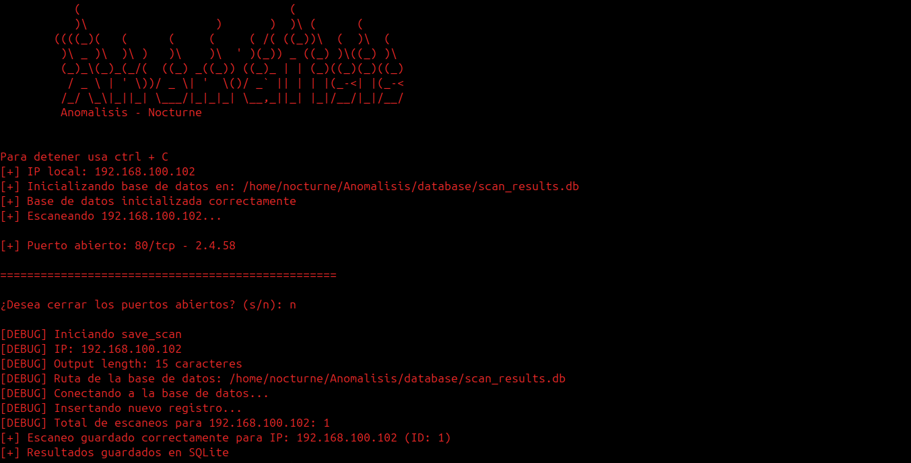

# Anomalisis - Escáner de Red


Una herramienta de escaneo de red basada en Python que proporciona capacidades completas de escaneo de puertos con características de seguridad e integración con base de datos.

## Características Principales

- Escaneo de puertos de red utilizando Nmap
- Manejo seguro de puertos con listas blancas
- Protección especial para puertos críticos (SSH, RDP, etc.)
- Almacenamiento en base de datos del historial de escaneos
- Interfaz de línea de comandos con salida detallada
- Validación de entrada y manejo de errores
- Soporte para múltiples formatos de salida (texto, JSON)
- Comparación entre escaneos para detectar cambios
- Configuración personalizable

## Requisitos

- Python 3.8 o superior
- Nmap (debe estar instalado en el sistema)
- Paquetes de Python listados en `requirements.txt`

## Instalación

1. Clona el repositorio:
   ```bash
   git clone https://github.com/nocturne-cybersecurity/Anomalisis.git
   cd Anomalisis
   ```
2. Crea un entorno virtual
   ```bash
   python3 -m venv .venv

   source .venv/bin/activate

   #En windows .\.venv\Scripts\activate
   ```

4. Instala los paquetes de Python requeridos:
   ```bash
   pip install -r requirements.txt
   ```

5. Haz el script ejecutable:
   ```bash
   chmod +x start.py
   ```

## Configuración Rápida (Crear Comando 'anomalisis')

1. Crea un enlace simbólico en tu directorio bin local:
   ```bash
   ln -s $(pwd)/start.py ~/.local/bin/anomalisis
   ```

2. Asegúrate de que `~/.local/bin` esté en tu PATH. Si es necesario, añade esto a tu `~/.bashrc` o `~/.zshrc`:
   ```bash
   export PATH="$HOME/.local/bin:$PATH"
   source ~/.bashrc  # o ~/.zshrc
   ```

3. Haz el script ejecutable:
   ```bash
   chmod +x ~/.local/bin/anomalisis
   ```

## Uso Básico

Una vez configurado, puedes ejecutar el escáner simplemente escribiendo:
```bash
anomalisis
```

## Interfaz de Línea de Comandos

### Uso Básico
```bash
anomalisis [OBJETIVO] [OPCIONES]
```

### Opciones de Escaneo
| Opción | Descripción | Ejemplo |
|--------|-------------|---------|
| `OBJETIVO` | Dirección IP o nombre de host a escanear (argumento posicional) | `anomalisis 192.168.1.1` |
| `-p, --ports PUERTOS` | Puertos a escanear (rangos o separados por comas) | `-p 22,80,443` o `-p 1-1024` |
| `-o, --output FORMATO` | Formato de salida (texto/json) | `-o json` |
| `-v, --verbose` | Mostrar salida detallada | `-v` |

### Operaciones con la Base de Datos
| Opción | Descripción | Ejemplo |
|--------|-------------|---------|
| `-d, --database` | Mostrar historial de todos los escaneos | `anomalisis -d` |
| `--show-scan ID` | Mostrar detalles de un escaneo específico | `--show-scan 1` |
| `--db-path RUTA` | Especificar ruta personalizada para la base de datos | `--db-path ruta/personalizada/bd.sqlite` |

### Comparación de Escaneos
| Opción | Descripción | Ejemplo |
|--------|-------------|---------|
| `--compare ID1 ID2` | Comparar dos escaneos por sus IDs | `--compare 1 2` |

### Opciones Generales
| Opción | Descripción | Ejemplo |
|--------|-------------|---------|
| `--version` | Mostrar versión y salir | `--version` |
| `-h, --help` | Mostrar mensaje de ayuda y salir | `-h` |

### Ejemplos Prácticos

1. Escaneo básico:
   ```bash
   anomalisis 192.168.1.1
   ```

2. Escanear puertos específicos con salida detallada:
   ```bash
   anomalisis 192.168.1.1 -p 22,80,443 -v
   ```

3. Escanear un rango de puertos y guardar como JSON:
   ```bash
   anomalisis 192.168.1.1 -p 1-1024 -o json
   ```

4. Listar todos los escaneos en la base de datos:
   ```bash
   anomalisis -d
   ```

5. Mostrar detalles de un escaneo específico:
   ```bash
   anomalisis --show-scan 1
   ```

6. Comparar dos escaneos:
   ```bash
   anomalisis --compare 1 2
   ```

7. Usar una ubicación personalizada para la base de datos:
   ```bash
   anomalisis --db-path /ruta/personalizada/escaneos.db -d
   ```

## Estructura del Proyecto

- `src/`
  - `core/` - Funcionalidad principal del escáner
    - `scanner.py` - Clase principal del escáner
    - `database.py` - Operaciones con la base de datos
  - `config/` - Archivos de configuración
    - `settings.py` - Configuración de la aplicación
    - `security.py` - Configuraciones de seguridad
  - `utils/` - Funciones de utilidad
    - `network.py` - Utilidades de red
- `start.py` - Punto de entrada principal
- `requirements.txt` - Dependencias de Python
- `README.md` - Este archivo de documentación

## Consideraciones de Seguridad

- El sistema incluye protección para puertos críticos
- Todas las entradas son validadas
- Las operaciones de base de datos usan consultas parametrizadas para prevenir inyección SQL
- Las operaciones sensibles requieren confirmación
- Se recomienda ejecutar el escáner con privilegios mínimos necesarios
- Los resultados pueden contener información sensible: asegúrate de manejarlos de forma segura

## Licencia

[Especifica tu licencia aquí]

## Contribuciones

Las contribuciones son bienvenidas. Por favor, crea un "pull request" con tus mejoras propuestas.

1. Haz un "fork" del proyecto
2. Crea una rama para tu característica (`git checkout -b caracteristica/nueva`)
3. Haz commit de tus cambios (`git commit -am 'Añade nueva característica'`)
4. Haz push a la rama (`git push origin caracteristica/nueva`)
5. Abre un "pull request"

## Soporte

Si encuentras algún problema o tienes sugerencias, por favor abre un "issue" en el repositorio.

## Estado del Proyecto

Este proyecto está en desarrollo.
Hecho por Nocturne
